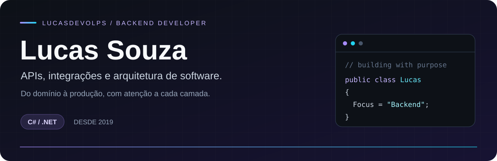

  

  <a href="#sobre">Sobre</a> &nbsp;·&nbsp;
  <a href="#projetos">Projetos</a> &nbsp;·&nbsp;
  <a href="#stack">Stack</a> &nbsp;·&nbsp;
  <a href="#engenharia">Engenharia</a> &nbsp;·&nbsp;
  <a href="#aprendizado">Aprendizado</a>

  <strong>Transformo regras de negócio em APIs e integrações que conectam pessoas, dados e sistemas.</strong>

  
  
  
  
  
  

## Muito prazer, Lucas 👋

Desenvolvo software desde **2019** e sou pós-graduado em **Arquitetura de Software pela Estácio**. Meu principal território é o backend com **C# e .NET**: modelar o domínio, construir APIs, integrar serviços e entender como tudo se comporta em produção.

Também desenvolvo interfaces com **Angular**, conectando as regras da aplicação à experiência de quem usa o sistema.

**O que me interessa:** resolver problemas reais, manter o código compreensível e evoluir a arquitetura conforme o projeto precisa.

## Projetos que colocam isso em prática

### 01 · Gestão Empresarial Hospitalar
**Pessoas, organizações e a evolução para escalas de trabalho.**

Sistema em desenvolvimento para gerenciar pessoas e a estrutura de múltiplas unidades hospitalares. O backend reúne autenticação, permissões, cadastros, auditoria e integração por eventos; a gestão de escalas é uma evolução planejada.

**Desafios de engenharia:** isolamento entre organizações, autorização, consistência de dados e confiabilidade das integrações com Outbox / Inbox.

`.NET 10` `Angular` `SQL Server` `Redis` `MassTransit` `OpenTelemetry` `Aspire`

**[Explorar backend →](https://github.com/LucasDevolps/Sistema.Gestao.Empresarial.Backend)** &nbsp;·&nbsp; **[Explorar frontend →](https://github.com/LucasDevolps/Sistema.Gestao.Empresarial.Frontend)**

---

### 02 · Central de Atendimento
**Tickets, atendimento e conversas em tempo real.**

Projeto de desafio técnico com abertura e acompanhamento de tickets e chat. Duas APIs mantêm bancos separados e se comunicam por eventos.

**Desafios de engenharia:** comunicação assíncrona entre serviços e atualização da interface em tempo real com SignalR.

`.NET 10` `Angular` `SQL Server` `RabbitMQ` `MassTransit` `SignalR` `Docker Compose`

**[Explorar backend →](https://github.com/LucasDevolps/central-atendimento-backend)** &nbsp;·&nbsp; **[Explorar frontend →](https://github.com/LucasDevolps/central-atendimento-web)**

---

### 03 · Desbravadores / Almirante
**Tecnologia aplicada à organização de um clube de Desbravadores.**

MVP funcional para autenticação, consulta de usuários e gestão de lançamentos financeiros, com paginação, busca e filtros.

**Desafios de engenharia:** validação dos lançamentos, autenticação JWT, testes de integração e diagnóstico da aplicação com Aspire e OpenTelemetry.

`.NET 10` `EF Core` `SQL Server` `JWT` `Aspire` `xUnit` `Docker`

**[Explorar backend →](https://github.com/LucasDevolps/Desbravadores.Backend)**

  <a href="https://github.com/LucasDevolps?tab=repositories"><strong>Ver todos os repositórios ↗</strong></a>

## Minha caixa de ferramentas

| Onde atuo | Tecnologias |
| :--- | :--- |
| **Backend** | C# · .NET 8 / 10 · ASP.NET Core · EF Core · MediatR · FluentValidation · OpenAPI |
| **Frontend** | Angular · TypeScript · RxJS · Signals · Reactive Forms · HTML · CSS |
| **Dados** | SQL Server · PostgreSQL · Oracle · Sybase · Redis |
| **Integrações** | RabbitMQ · MassTransit · Apache Kafka · SignalR |
| **Infraestrutura** | Docker · Compose · Kubernetes · Nginx · Linux · WSL 2 |
| **Cloud** | Azure / AKS · AWS / EC2 / RDS / ECR / EKS · HPA · KEDA |
| **Observabilidade** | OpenTelemetry · Datadog · logs estruturados · métricas · traces · health checks |
| **Entrega e qualidade** | GitHub Actions · Azure DevOps · xUnit · WebApplicationFactory · CodeQL · Dependabot |

<strong>Mais ferramentas e tecnologias da minha trajetória</strong>

- **Frontend:** JavaScript, React, Bootstrap, jQuery, Jasmine e Karma.
- **Dados e busca:** MySQL, MongoDB e Elasticsearch.
- **Qualidade e segurança:** SonarCloud, Veracode, Trivy e SBOM.
- **Automação:** PowerShell, Bash, Python para scripts e Jenkins.
- **Ferramentas e legado:** Git, Visual Studio, VS Code e ASP Classic.

## Como penso software

| Princípio | Na prática |
| :--- | :--- |
| **Arquitetura com propósito** | Clean Architecture, SOLID e CQRS quando ajudam a organizar os casos de uso. |
| **Segurança desde a API** | JWT, gestão de sessões, autorização por permissões, rate limiting e isolamento de dados. |
| **Integrações confiáveis** | Eventos, Outbox / Inbox, idempotência, retries e tratamento de falhas. |
| **Dados consistentes** | Validações de negócio, prevenção de duplicidades, transações e migrations. |
| **Operação visível** | Logs, métricas e traces para acompanhar o comportamento da aplicação. |
| **Entrega cuidadosa** | Testes dos fluxos críticos, revisão por pull requests e análise de dependências. |

## Sempre em construção

Continuo estudando na **Full Cycle** e colocando o aprendizado em projetos práticos. Hoje, aprofundo meu trabalho em:

- **Sistemas distribuídos:** mensageria e consistência entre serviços.
- **.NET Aspire:** orquestração local e diagnóstico integrado à observabilidade.
- **Escalabilidade:** Kubernetes, KEDA e estratégias de operação.
- **Azure:** fundamentos e preparação para a certificação AZ-900.
- **Domínio hospitalar:** evolução para gestão e automação de escalas.

---

  <strong>Regras claras. Integrações confiáveis. Software que evolui.</strong> 
  Lucas Souza · <a href="https://github.com/LucasDevolps">@LucasDevolps</a>

